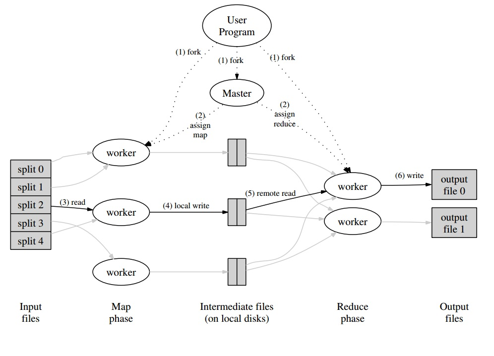

# Mit 6.824 Lab 1 Mapreduce 实验报告
lab1的主要目的就是熟悉GO语言, 难度适中
## Mapreduce主要思想

map     (k1,v1)          -> list(k2,v2)
reduce  (k2,list(v2))    -> list(v2)

- Map
    取key/value pairs (k1,v1), 并通过Map操作产生一个中间k/v集合list(k2,v2). Mapreduce库将所有具有相同的intermediate key $I$的值收集起来,形成一个k2对应的集合list(v2), 并将其传递给reduce函数.
- Reduce
    接受一个Intermediate key $I$ (k2), 及其值的集合list(v2). reduce操作合并集合中所有的值,并产生一个较小的集合list(v2)--通常来说每个reduce操作只会产生零个或一个输出值. 即len(list(v2)) == 0 or 1

### 例子: 单词计数

假设有很多文件, 每个文件包含很多的单词. 为了统计文件中单词的个数, 可设计如下的Map-Reduce操作    

```Java
    map(String key, String value):
        // key:     document name
        // value:   document content
        for each word w in value:
            EmitIntermediate(w,"1");
        
    //具有相同w键的值会被收集起来,传递到reduce中
    //如reduce接受到的key为apple, 而values 为["1",...,"1"]

    reduce(String key, Iterator values):
        // key : a word
        // values: a list of counts
        int result = 0;
        for each v in values:
            result += ParseInt(v);
        Emit(AsString(result));
        //这里的reduce最终输出其实就是单词的个数
```

## Mapreduce实验

### 串行化的Mapreduce -- 单词计数

1. 对于每个文件运行一次Map操作, Map操作生成一个数组kva, 包含了所有的键值对, 然后append进intermediate的列表中.

```Go
    intermediate := []mr.KeyValue{}
	for _, filename := range os.Args[2:] {
		//...代码省略
		kva := mapf(filename, string(content))
		intermediate = append(intermediate, kva...)
	}
```

2. 对intermediate按照key的大小进行排序.
```Go
    sort.Sort(ByKey(intermediate))
```

3. 将key相同的value值聚合在一起, 并通过reducef得到最后的输出,并保存在ofile中. 即统计intermediate中有多少个[key, "1"]

```Go
    for i < len(intermediate) {
		j := i + 1
		for j < len(intermediate) && intermediate[j].Key == intermediate[i].Key {
			j++
		}
		values := []string{}
		for k := i; k < j; k++ {
			values = append(values, intermediate[k].Value)
		}
		output := reducef(intermediate[i].Key, values)

		// this is the correct format for each line of Reduce output.
		fmt.Fprintf(ofile, "%v %v\n", intermediate[i].Key, output)

		i = j
	}
```

### 分布式Mapreduce

#### 主要功能

主要的框架分为两种进程, Coordinator和多个Workers.
采用生产者消费者模式:
- Coordinator: 生产者, 产生需要执行的任务
- Workers : 消费者, 消费从Coordinator获取的任务


##### Map阶段

Mapper读取输入文件的切片split#, 并通过mapf处理, 每个Mapper生成NReduce个中间文件(保存在本地). Mapper产生的kv经过key的hash后,会被放到指定的中间文件中. 每个Mapper产生的相同的Key只能出现在一个中间文件中. 这些中间文件在Reduce阶段只会由一个Reducer进行处理.
##### Reduce阶段
假设有M个mapper, R个Reducer. 第m个Mapper产生的第r个reduced中间文件用 `Inter[m][r]`表示. 那么对于每个Reducer `r`, 首先会合并所有Mapper产生的`r`号文件, 即`[Inter[0][r], .., Inter[m-1][r]]`. 并对合并的数据进行汇集, 将具有相同Key的Value形成一个列表, 即前文所属的(k2,list(v2)). 再通过reduce函数生成最后的结果.


注意:

- 通常多个Workers会分布在多个机器当中, 通过RPC与Coordinator进行通信. (本实验所有进程运行在一个机子上.)
- 如果一个Worker超时未完成任务(比如机器down了),  Coordinator应该知晓,并将相同的任务分配给另一个Worker去完成.


#### 实现细节

课程要求不能公开源码, 这里主要提几点设计的要点:

- Coordinator与Worker之间通过RPC通信. 主要有两个调用函数 GetTasks和FinishedTasks. GetTasks从Coordinator中获取任务, FinishedTasks用于通知Coordinator任务已完成. RPC使用Task结构体传递信息. 
    Tasks结构体主要包含以下信息(注意RPC类型首字母要大写):
    - Task_idx (表示任务的序号, 用以区分不同的Mapper或Reducer)
    - Task_Type (用以标识任务的类型:Mapping, Reducing 和 Finishing)
    - NReduce
    - NMap
    - File_name (处理的文件名)
    - Begin_Timestamp (任务开始的时间)

- Coordinator需要知晓Worker宕机. 主要的实现就是当Worker在分配任务一段时间后没有完成任务(如10s), Coordinator则认为Worker崩溃,需要将任务重新分配给另一个Worker执行. 
为了实现此项功能, Coordinator维护两个队列 
    - Tasks_Ready: 表示待分配的任务, 用一个带缓存的Channel实现, 可通过阻塞实现同步.
    - Tasks_Assigned: 表示已分配但未完成的任务, 用map进行存储, 能够通过idx进行快速的查找

在Worker调用GetTasks后, Coordinator会添加一个10s定时器, 并保存在map容器中,通过Tasks_Key查询. 如果任务按时完成, 那么在FinishedTasks的调用中会从map当中获取其对应的计时器, 并取消计时. 若任务没有按时完成, 定时器超时后回调TimeoutHandler, 将超时的Tasks重新放入Tasks_Ready队列,等待其他Worker获取.
- 任务完成时Worker需要传回的Task结构体, Coordinator需要对比传回Task的Begin_TimeStamp与Tasks_Assigned队列当中的Begin_TimeStamp是否一致. 如果不一致说明是因为历史的超时Worker返回的结果. 那么则忽略这次结果. (此实现有点粗糙)

Reduce阶段需要在Map阶段后执行, 因此Coordinator会记录完成的Map任务数, 所有的Map完成后再往Tasks_ready队列中加入Reduce的任务.


