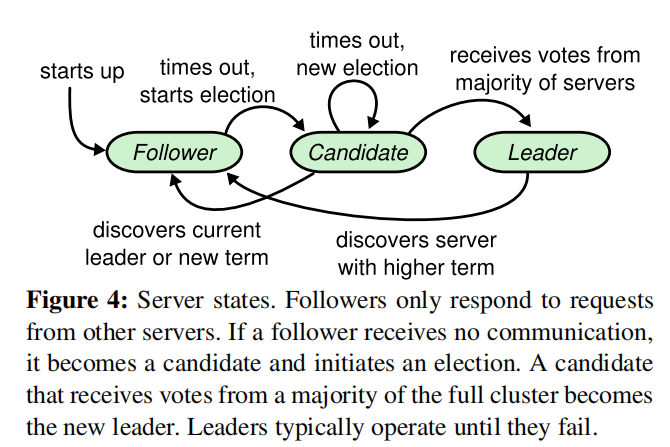

# Raft 共识算法

## 背景

在分布式场景中, 即使机器发生故障的概率很小, 但当主机数很大时(如成千上万时), 总会有个别的主机会出现故障. 为了保证在个别机器故障时, 整个分布式系统依然能够正常对外服务, 这就需要通过一些冗余的机制去实现. 这被称为分布式系统的容错性(Fault Tolerance). 
主要的办法就是通过"复制"(Replication)的手段, 复制一份或多份状态(数据)的副本, 并分布到不同的机器当中, 当机器故障时, 存有副本的机器就能及时上线(Go lives), 接替故障机器的工作.
主要的Repliacation有两种类型:
##### State Transfer : 
直接复制内存的数据, 对整个数据副本进行拷贝, 通常消耗较大.
##### Replicated State Machine
对外部事件进行复制, 如外部的读写时间. 根据状态复制的层级不同, 主要有两种做法:
- 复制应用层面的状态. 如GFS
- 复制机器层面的状态, 完全复制一台机器的寄存器, 中断信号等. 被称为虚拟机(Virtual Machine)

目前主要的技术都集中在Replacated State Machine 上. 主要的难点在于, 如何保证主机Primary与从机replica(s)之间状态的一致性?(Consistency).
### 一致性问题发生在哪?
假设下图的一个场景. 拥有一主一从的分布式系统中, 假设有两个Client(C1, C2)分别对变量x进行写入操作Wx, C1将1写入x中: Wx1, C2将2 写入x中: Wx2. 在一个坏的设计中, 如果不经过一致性的保护, C1, C2仅仅只是分别的将两个请求同时发送到主从服务器中. 但是由于网络的不确定性, 并不能保证Wx1与Wx2两个操作到达Server1与Server2的顺序是否一致. 若顺序不一致, 就会导致主从服务器X变量的值不同, 这就产生了**不一致性**.

而Raft算法就是一种解决主从复制一致性的分布式共识算法.

## Raft 分布式共识算法

>论文链接
>Diego Ongaro and John Ousterhout. 2014. In search of an understandable consensus algorithm. In <i>Proceedings of the 2014 USENIX conference on USENIX Annual Technical Conference</i> (<i>USENIX ATC'14</i>). USENIX Association, USA, 305–320.
>[https://pdos.csail.mit.edu/6.824/papers/raft-extended.pdf](https://pdos.csail.mit.edu/6.824/papers/raft-extended.pdf)

-强烈推荐先看Raft的动画演示, 对Raft的有一个整体的印象, 再去看论文的细节. 推荐一个动画演示的网站:
http://thesecretlivesofdata.com/raft/

- a lab guidance written by the Teaching Asistance of MIT 6.824, in which you may find it very helpful during implementng the lab: https://thesquareplanet.com/blog/students-guide-to-raft/

### 提出背景与Paxos

... 待完善

#### Raft算法基础
对于任何一个时刻, 每个服务器只能以下三种状态之一: 
- Leader
- Follower
- Candidate
通常情况下只有1个Leader, 剩下的服务器都是Follower. Follower只被动的接收来自Leader和Candidate的请求,而自身不发出请求. 所有来自客户端的请求都由Leader进行处理, (若客户端请求了一个Floower, 其会重定向至其Leader). Candidate是为了选举出一个新的Leader而存在的状态. 状态之间的转移如图:

    

每个服务器会存储一个current term数字, 表示当前任期的编号, 这个编号随着时间单调递增. 这个任期编号会在不同的服务器进行交换. 分三种情况:
- 如果当前服务器的current term小于其他服务器的term, 那么它就会更新自己的term到一个更大的值
- 如果一个Leader或者Candidate发现自己的term过期了, 那么就会立即回到Follower的身份
- 如果一个server收到了一个过时term的请求, 它会直接拒绝

服务器之间采用RPC进行通信, 主要有两个调用:
- RequestVote: 被Candidate用来进行Leader选举
- AppendEntries: 由Leader向其他replicas复制日志条目的副本. 同时用来发送心跳信号.

#### Raft算法需要保证的一些性质
在了解算法之前, 先了解下Raft算法所要实现的目标是什么,主要由以下五条:
- **Election Safty**: 每个任期只能有一个Leader
- **Leader Append-Only**: Leader永远不会重写和删除它日志中的条目, 只会append新的条目. 也就是说Leader对日志拥有领导权.
- **Log Matching**: 如果两个日志当中有两条index与term都相同的条目, 那么所有小于等于该index的日志条目都是确定唯一的
- **Leader Completeness**: 如果一个日志条目已经在某一term提交了,那么在接下来的任期(higher-numbered terms)的Leader中都会包含此条目. 即无论下一个Leader是谁, 他的log当中都应该包含系统中所有已提交的日志条目
- **State Machine Safety**: 如果一个服务器已经将日志条目应用到state machine去了, 那么任何其他服务器都不能提交一个具有相同index的不同条目. 即所有对State Machine的提交都是一致的.

#### Leader Election
所有的servers都从Follower角色开始. 只要一个server持续收到来自Leader的心跳信号, 那么它就会一直保持Follower的状态. Leader会周期性的通过发送心跳信号(通过没有log entreis的AppendEntries RPC)来保持自己的统治地位. 如果一个Follower一段时间都没有收到心跳信号, 就会触发超时, 称为**Election Timeout**, 此时服务器就会认为Leader已挂, 并开始选举一个新的Leader.
##### Election的流程
- follower首先自增自己的current term,并转变成candidate身份
- candidate投自己一票, 并向集群中的其他服务器并发的发送Request Vote RPC.
- candidate会一直处于自己的状态, 直到下列三件事发生:
    - 赢下选举
    - 其他服务器确立了自己的leader地位
    - 一段时间后没有winner

###### 赢下选举
...

###### 其他服务器赢下选举
在等待选举的过程中, candidate可能会收到其他服务器的AppendEntries RPC, 即有其他服务器宣称自己是leader, 如果leader的term大于等于candidate的current term, 那么candidate就认为leader是合法的,并回到follower状态

###### Split Vote
一段时间后, candidate们之间的投票意见不一,选举超时. 通常会在所有candidate在同一时间开始选举时发生. 再超时后, current term自增, 新的一轮选举会开始.

为了解决candidate同时开始选举而产生的Split Vote现象, Raft设计election timeout的时间为一个区间随机值, 比如在150 ~ 300 ms之间.